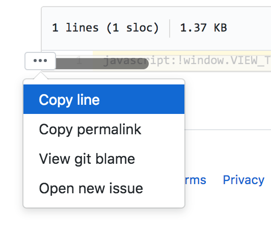

# bookmarklets

ブックマークレットをまとめます。

JavaScriptを書く機会がないWebディレクターさんなど、非制作職の方々にご利用いただければと思います🙆‍♀️

原則汎用的なもののみを掲載していく方針です。

## 利用方法

各種日本語名フォルダの中にあるファイルのうち`.min.js`で終わっているものをご利用ください。

行頭を押下することで行コピーができます。

### ブックマークレットとは

`javascript:`で始まるコードがブックマークレットです。そのままブックマークに登録できます。

参照：[https://qiita.com/aqril_1132/items/b5f9040ccb8cbc705d04](https://qiita.com/aqril_1132/items/b5f9040ccb8cbc705d04)

## 諸注意

- 原則、利用環境はGoogle Chrome最新版を想定しています
- 厳密なテストは実施していません
- FB対応は保証できませんが、必要に応じて issue を立てていただければ修正致します
